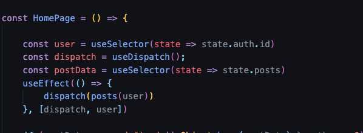
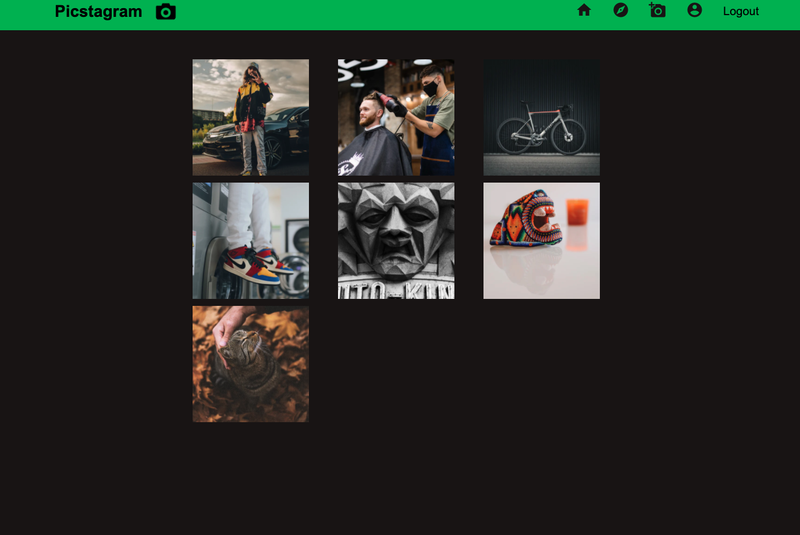
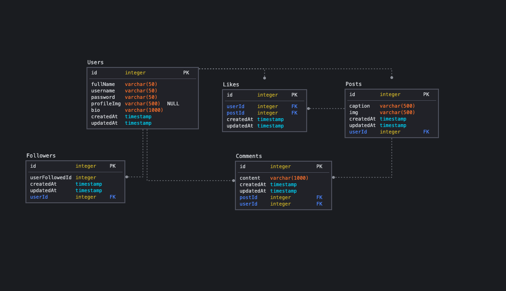

# Picstagram
*By Matt Zamora  - visit* [Picstagram](https://picstagram2051.herokuapp.com/login)

Table of Contents

* Picstagram Overview
* Technologies Used
* FrontEnd Overview
* BackendOverview
* Conclusion

### Hitstagram Overview

Hitsagram is a full stack application that allows the user to make posts, like and comment on a post, follow other users and edit their profile. The app is based off the social media web app instagram.

## Technologies Used

* Frontend
	* React.js
	* Redux
	* CSS
	* Material UI Icons
	
* Backend
	* Flask
	* SQLAlchemy
	* PostgreSQL

## FrontEnd Overview

### React
Using React as the frontend application allowed me to leverage Redux and the different hooks that are available. I managed state throughout the application using the useState hook and handled asynchronous calls to the backend with the useEffect hook.

### Redux
Redux allowed me to create a better way to manage my state throughout my application. By managing the state through the store I can update multiple components that rely on the same information.

## Material UI Icons
Material UI Icons are used for the navigation bar Icons. 

## CSS
CSS styling is used for the styling throughout the page. Using grids makes it easier to space the profile and exlore page.

## Backend Overview

### Flask
The python web framework flask is used for the backend.  Flask is a great lightweight framework to use because it allows for easy integration with PostgreSQL and SQLAlchemy ORM. For a smaller application it is an effective framework to use becauase it isn't to difficult to set up and comes with some handy tools like flask-login.

### PostgreSQL
PostgreSQL was a great RDBMS to use. Its fairly simple to integrate it with the Flask framework and store different reltionships between models.

## Conclusion
Picstagram was a fun application to build. I enjoy using React to build applications and using python on the backend. I think it is a good type of application to use a relational database for. If I were to do something different I would use Django for the backend instead of flask. In the future I would like to implement modal's when uploading images. My understanding of React and Redux grew a ton while working on this project and I think React is a great library to use. Managing state with Redux is also very effective and I would like to explore different way's of managing state for my next project. I learned a lot about the process of building my 2nd solo project and plan to apply that knowledge to many more!
